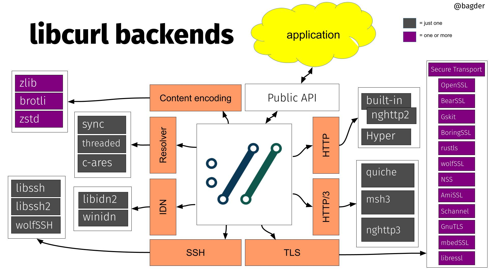

# Backends

A backend in curl is a **build-time selectable alternative implementation**.

When you build curl, you can select alternative implementations for several
different things. Different providers of the same feature set. You select
which backend or backends (plural) to use when you build curl.

- Backends are selectable and deselectable
- Often platform dependent
- Can differ in features
- Can differ in 3rd party licenses
- Can differ in maturity
- The internal APIs are never exposed externally

## Different backends

In the libcurl source code, there are internal APIs for providing
functionality. In these different areas there are multiple different providers:

1. IDN
2. Name resolving
3. TLS
4. SSH
5. HTTP/1 and HTTP/2
6. HTTP/3
7. HTTP content encoding

## Backends visualized

Applications (in the upper yellow cloud) access libcurl through the public
API. The API is fixed and stable.

Internally, the "core" of libcurl uses internal APIs to perform the different
duties it needs to do. Each of these internal APIs are powered by alternative
implementations, in many times powered by different third party libraries.

The image above shows the different third party libraries powering different
internal APIs. The purple boxes are "one or more" and the dark grey ones are
"one of these".
